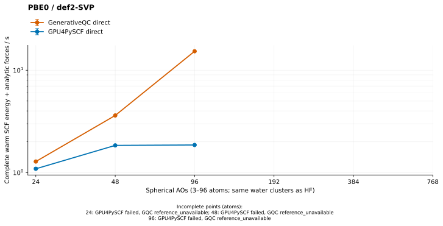

# PBE0/def2-SVP: GenerativeQC versus GPU4PySCF



This is a **complete energy + analytic-force baseline**, not the earlier
energy-only DFT comparison. It uses the HF README's nested water32mer prefixes,
full spherical def2-SVP and five fixed engine-local density replays. Both
engines use direct FP64 integrals and the same explicit moving quadrature.
No density fitting, VV10, reference-density borrowing or opt-in native
performance setting is used. The HF results and all OMol25 work are preserved.

Lines show the median of **all five** original-geometry warm observations;
bars show their min/max. A native point qualifies only after cold, moved and
all ten original/moved warm calls pass their independent energy/force gates.
Incomplete points are status labels, not elapsed-time bounds or extrapolations.

## Complete warm medians, seconds

| Atoms | Spherical AOs | GenerativeQC | GPU4PySCF | Native / reference |
| ---: | ---: | ---: | ---: | ---: |
| 3 | 24 | 1.281241 | 1.088028 | 1.18× |
| 6 | 48 | 3.612441 | 1.842444 | 1.96× |
| 12 | 96 | 15.322144 | 1.859755 | 8.24× |
| 24 | 192 | Not run: no complete oracle | SCF not converged | — |
| 48 | 384 | Not run: no complete oracle | SCF not converged | — |
| 96 | 768 | Not run: no complete oracle | SCF not converged | — |

**The current PBE0 default is slower at every qualified size.** These results
are a baseline for further optimization, not a claim of parity or a through-100
atom speedup. Native takes one SCF iteration in every original/moved warm
repeat. GPU4PySCF takes 1/3/2 original warm iterations at 3/6/12 atoms and 1/3/3
moved warm iterations. All repeats remain in the plot; timings are not divided
by iterations. Native Fock-build counts are unavailable (`null`), rather than
inferred from those iterations. GPU4PySCF records 2/4/3 original warm
`get_veff` calls, including the pre-loop build.

## Cold and changed-geometry endpoints, seconds

| Atoms | Native cold | Reference cold | Native moved | Reference moved | Native moved warm | Reference moved warm |
| ---: | ---: | ---: | ---: | ---: | ---: | ---: |
| 3 | 254.744005 | 12.523574 | 2.775908 | 8.194488 | 1.282045 | 1.081498 |
| 6 | 73.821714 | 15.286771 | 6.936849 | 9.792719 | 3.603904 | 1.841868 |
| 12 | 95.923410 | 24.921088 | 25.285963 | 16.835801 | 15.320418 | 2.259086 |

Cold includes preparation and the first synchronized energy/force execution,
including any runtime CUDA generation/compilation/cache setup required by that
execution. Imports, library hashing and device probes are outside the timer.
The large first native cold point must not be confused with warm latency;
the compiler cache is not purged between sizes. Moved timings include native
geometry invalidation/rebuild or reference engine/grid preparation, plus the
complete reconverged endpoint. No startup cost is subtracted from these totals.

## Scientific protocol and acceptance

- Neutral RKS water prefixes, 3/6/12/24/48/96 atoms and 24/48/96/192/384/768
  spherical AOs. The offline [H/O snapshot](def2-svp-ho.json) comes from the
  repository's bundled Basis Set Exchange 0.11 def2-SVP data. Every contraction
  and polarization shell is retained; the identical decimals are passed to
  GPU4PySCF. The canonical checksum is
  `fad2c7433fe5fac19525d4c80fbd995a7ebed7816b7ea4bb88547e4f6a58a3d8`.
- Explicit grid: 48 rational-Legendre radial points × 16 Legendre polar points
  × 32 trapezoidal azimuth points per atom, radius 1 Bohr, three original-Becke
  iterations, no radii adjustment, pruning or small-density grid deletion.
  This is an identical discrete moving grid, not each engine's unrelated
  default accuracy-level grid. GPU4PySCF owns its grid generation, partitioning,
  integrals, XC, SCF and analytic grid-response implementation.
- Native energy tolerance `1e-12 Eh`, density tolerance `1e-10`, screening
  `1e-12`, maximum 100 SCF iterations. GPU4PySCF uses energy tolerance
  `1e-12 Eh`, orbital-gradient tolerance `1e-10`, direct screening `1e-14`
  and maximum 100 iterations. These match the current HF endpoint protocol;
  equal public tolerances do not imply identical internal stopping policies.
- Each engine owns its cold density. Five warm calls replay a frozen post-cold
  seed without updating it. Atom two then moves +0.001 Bohr in z, reconverges
  normally, and supplies the fixed seed for five moved-warm calls. No native
  density or derivative comes from PySCF/GPU4PySCF.
- Each timed endpoint returns the energy and the complete host force array.
  GPU4PySCF enables `gradient.grid_response = True`; its force `asnumpy`
  transfer and final stream synchronization occur before stopping the clock.
  Native uses public `execute(properties=("energy", "forces"))`.
- All 36 native endpoints pass finite-value, convergence, shape and independent
  absolute gates of `1e-8 Eh` and `1e-7 Eh/Bohr`. Observed maxima are
  **`1.13e-11 Eh`** and **`2.86e-11 Eh/Bohr`**. Reference repeats also pass
  their original/moved baseline consistency gates. Per-call residuals,
  iterations, errors, flags and raw forces are retained, not just medians.

## Larger points and resource limits

GPU4PySCF's 24/48/96-atom cold SCF did not converge within the stated 100-step
protocol. These failures are retained; tolerances, the grid and the method
were not relaxed to fill in the curve. Native execution is skipped when no
complete independent reference exists.

Independently, the current public global-hybrid generated force implementation
has a **128-AO/32-atom** admission limit and a default one-million-grid-point
bound. Consequently, the 24/48/96-atom def2-SVP force endpoints are not qualified
by the current implementation, even if a reference SCF is repaired later.
The benchmark does not remove those guards, enlarge the production budget,
substitute energy-only timings or claim 100-atom support. Extending the domain
requires a complete resource inventory and new independent force qualification.

## Provenance and retained evidence

- GitHub `master` was verified and fetched on October 1, 2026 at
  `076bdf1e882901668395a5d919bc15e1506dac46`. All existing through-f, default
  screened Cartesian-source, derivative-seed and HF-reuse changes remain in
  the dirty worktree. They are not discarded or relabeled as upstream commits.
- Release CUDA 12.9.1 / sm_120, generated shell AOT enabled; C++ and CUDA
  compilation use `ccache` and the build runs with `-j40`. Native library
  SHA-256 is
  `798e781c5ab13b501a76d81b4e79c3ebd1c0fbb4a856b0435708fc73245bed9a`;
  native source identity is
  `c3cfe436444a349d7de1ff3f4b06788232ee6f38c360e787b80e2023054b5f02`.
- RTX 5090, eight OpenMP/OpenBLAS/MKL threads; GPU4PySCF 1.8.1, PySCF 2.14.0,
  CuPy 13.6.0, NumPy 2.4.6, cuTENSOR 2.2.0 and LibXC 7.0.0 (CUDA).
  Reference Slurm job **11967** and qualified native job **11969** run as
  separate finite processes on `main`, with `--gres=gpu:5090:1`, preserving
  scheduler device visibility. Device/clock snapshots are setup metadata,
  not a time-resolved endpoint profile.
- [water3.json](water3.json), [water6.json](water6.json) and
  [water12.json](water12.json) retain every scalar sample, both independent
  cold/moved force oracles, all gates, work counts, source-file hashes,
  binary identity and scheduler outcomes. The other size records retain
  explicit failures and skipped-native outcomes.
- `water<atoms>-{native,reference}.json.gz` retains the exact raw journals,
  including forces for **every** call. Decompressed SHA-256 must match the
  corresponding `raw_sha256` in the compact evidence. Historical failed
  driver attempts and pre-task code/untracked-file/library checkpoints remain
  in ignored `.artifacts/pbe0-readme-20261001/` storage, separate from accepted
  measurements.
- Force component timings and semantic work are the last measured generated
  force execution, not a profile-derived replacement for endpoint timing.
  Logical/capacity quartet counts are not promoted to post-screen ERI counts;
  missing counters remain empty or `null`. Profiling is not enabled for clean
  timing, so zero-valued optional device timers are not speed evidence.

## Reproduce

From the repository root, with the recorded Release library and GPU Python
environment available:

```bash
export GENERATIVEQC_LIBRARY="$PWD/build/cuda-release-sm120/libgenerativeqc.so"
export PBE0_BASIS_FILE="$PWD/benchmarks/results/pbe0-def2-svp-20261001/def2-svp-ho.json"
export PBE0_BENCHMARK_PYTHON="$PWD/.artifacts/gpu-env/bin/python"
export PBE0_BENCHMARK_OUTPUT="$PWD/.artifacts/pbe0-reproduction"
export CUDA_PATH=/group/software/cuda-12.9.1
export LD_LIBRARY_PATH="$PWD/.artifacts/gpu-env/lib/python3.13/site-packages/cutensor/lib:$CUDA_PATH/lib64${LD_LIBRARY_PATH:+:$LD_LIBRARY_PATH}"
srun --partition=main --gres=gpu:5090:1 --nodes=1 --ntasks=1 \
    --cpus-per-task=8 --time=01:20:00 bash benchmarks/run_pbe0_benchmarks.sh
```

Each engine/size has a 360-second point limit and an independent journal,
log and outcome. The runner returns nonzero when any point fails or lacks a
complete reference; earlier accepted points remain available. CPU-only
validation/rendering uses:

```bash
PYTHONPATH=python:. .venv/bin/python -m tools.render_readme_pbe0 \
    --raw-directory .artifacts/pbe0-reproduction \
    --basis-file benchmarks/results/pbe0-def2-svp-20261001/def2-svp-ho.json \
    --destination .artifacts/pbe0-reproduction/figure
```
