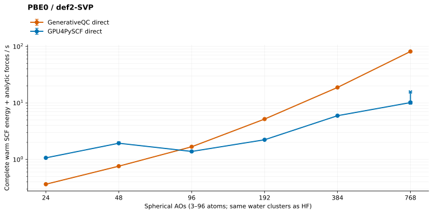

# PBE0/def2-SVP: grid reuse and cooperative force work



Frozen master `74c89369ce10a7c07a5a6b3edc37d03b8af2b791` plus this change's
three production edits completes **72 native and 72 independent reference
energy-plus-analytic-force endpoints**. This is not an unmodified-master result.
The main README's DFT publication hold remains in place.
Subsequently fetched master `9a5871dca` changes nonlocal-force capacity, not
this PBE0 path; it is not relabeled as the measured build.

## Complete warm medians, seconds

| Atoms | Spherical AOs | Native | GPU4PySCF | Native / reference |
| ---: | ---: | ---: | ---: | ---: |
| 3 | 24 | 0.364009 | 1.066153 | 0.34× |
| 6 | 48 | 0.759451 | 1.934147 | 0.39× |
| 12 | 96 | 1.674886 | 1.383903 | 1.21× |
| 24 | 192 | 5.179368 | 2.227932 | 2.32× |
| 48 | 384 | 18.794478 | 5.940682 | 3.16× |
| 96 | 768 | 81.308650 | 10.141946 | 8.02× |

These are the five **original-geometry** replay medians, not pooled original/
moved medians. Every observation contributes to the chart's median and range.
All 60 native warm calls take one iteration, with no cold fallback. Reference
original warm iterations are 1/3/1/1/3 at 3–48 atoms and `[4,1,1,1,1]` at 96;
its moved 96-atom replays take `[1,1,1,7,1]`. No sample is removed or divided by
its iteration count.

**Large-system performance remains unresolved.** The retained
[convergence-repair baseline](../pbe0-def2-svp-20261003/README.md) reports
106.987277 s at 96 atoms; this campaign reports 81.308650 s, about 24% less time.
Those are separate same-host campaigns, not interleaved controls. The new
reference also runs faster, so the remaining relative gap is still about 8×.
Do not claim that this incremental improvement closes the gap.

## Cold and changed geometry, seconds

| Atoms | Native cold | Reference cold | Native moved | Reference moved | Native moved warm | Reference moved warm |
| ---: | ---: | ---: | ---: | ---: | ---: | ---: |
| 3 | 58.205846 | 14.058620 | 1.965482 | 9.485005 | 0.362942 | 1.075667 |
| 6 | 52.888460 | 18.217334 | 4.145002 | 12.689919 | 0.760136 | 2.586994 |
| 12 | 64.131273 | 18.363977 | 10.151270 | 17.859972 | 1.677318 | 2.210398 |
| 24 | 88.067455 | 42.488558 | 27.313339 | 30.642841 | 5.192022 | 2.223113 |
| 48 | 183.676314 | 52.067079 | 72.790036 | 49.229385 | 18.781750 | 4.086485 |
| 96 | 530.723500 | 92.183461 | 265.322378 | 87.773229 | 81.542779 | 10.108653 |

Cold includes preparation and required JIT/cache setup, not imports or binary
hashing. Caches are not purged between sizes. Moved includes invalidation,
preparation and reconvergence; native 96-atom cold/moved calls take 26/12
iterations. Both engines return host forces and synchronize within the timer.
GPU4PySCF includes analytic moving-grid response. Cold changes are not isolated
kernel speedups.

## Unchanged scientific contract

- Neutral water32mer prefixes; full spherical def2-SVP, using the retained
  [offline H/O basis](../pbe0-def2-svp-20261003/def2-svp-ho.json).
- Unpruned moving grid: 48 rational-Legendre radial × 16 Legendre polar × 32
  trapezoidal azimuth points per atom, radius 1 Bohr, three original Becke
  iterations, no radii adjustment or small-density grid deletion.
- Native energy/density tolerances `1e-12 Eh`/`1e-10`, screening `1e-12`;
  reference energy/gradient tolerances `1e-12 Eh`/`1e-10`, screening `1e-14`;
  both allow 100 iterations. Equal tolerances do not mean identical solvers.
- Independent absolute gates `1e-8 Eh` and `1e-7 Eh/Bohr` apply to **every**
  endpoint. Maximum native errors are `1.036824e-10 Eh` and
  `3.101085e-11 Eh/Bohr`. All reference consistency gates pass too.
- Each engine retains its own post-cold density for five frozen replays.
  Atom two moves +0.001 Bohr in z; five further replays use that engine's
  separately converged moved density. No reference density enters native work.
- No density fitting, mixed precision, AO screening, changed budgets or
  experimental larger tiles. Public SCF/force tiles remain 256 points.
- The reference rebuilds complete-density `get_veff` instead of consuming
  incremental `dm_last`/`vhf_last`. Its full timed work is retained; this
  benchmark-only adapter does not modify native execution.

## What changed and what still costs time

The stationary compiler distributes independent AO pullbacks over the existing
cooperative block, borrowing dead, already charged Becke shared storage. Each
atom and point-motion reduction keeps the original AO order. Insufficient
shared capacity retains scalar AO evaluation.

The native grid owner reuses a single product panel only after a successful
resident restricted-spin split proves identical owned alpha/beta densities.
Every density/source/center replacement revokes that witness before validation.
One same-stream device copy fills the existing beta panel, including tau-only
masks; unproven and orbital sources retain their original paths.

For at least 32 active AOs, compiler-emitted grid features use one warp per
point and a fixed reduction tree. Smaller/empty active maps retain scalar
summation. This changes reduction order, not the shared feature algebra, and
has independent physical and long-double host-oracle qualification.

The separately frozen **master52** composed candidate was profiled in node3
job 12100 against baseline job 12097. It is not relabeled as the final-master
binary. [Measured work](profile96-work.json) reports:

| Instrumented 96-atom kernel family | Baseline seconds | Candidate seconds |
| --- | ---: | ---: |
| Bounded shell derivatives | 29.237759 | 29.183897 |
| Cooperative geometry | 28.424543 | 18.814593 |
| Density-product GEMM family | 17.298339 | 8.655410 |
| Grid features | 9.516827 | 0.342265 |

Geometry and feature launches both remain 9,216. GEMM-family instances fall
from 18,496 to 9,280, exactly one fewer per force tile. Nsight records 9,216
new 6,291,456-byte device copies: 57,982,058,496 bytes in 0.027549 s. AO
pullbacks and feature bilinears still evaluate each spin/AO/point once; these
are schedule/reuse changes, not screened work removal. Instrumented kernel
times are neither publication wall samples nor additive host phase timings.
Bounded derivatives, geometry and native SCF remain the next bottlenecks.

At 96 atoms, the unchanged work plan has 2,359,296 grid points, 9,216 geometry
batches, 21,516,784,080 partition grid-pair visits and 10,752-point chunks.
Raw journals retain the resource bounds, work classifications and per-call
timings. Unavailable measurements remain null; logical capacity is not a
post-screen executed-integral count.

## Provenance and qualification

[provenance.json](provenance.json) binds base commit, modified production and
test hashes, native library identity, generated JIT sources and local receipts.
[jit-manifests.json.gz](jit-manifests.json.gz) retains compiled-object identities,
source/header hashes, flags and toolchain information. Native library SHA-256:
`955293a77d2f662abdd6b180cd3b9eae957ea1f36f93bdb1de392a6915402644`.

- Native endpoints: n1 jobs 5445 (3/6/12/24), 5447 (48), 5446 (96).
  Independent references are reused **byte-for-byte** from the preceding
  freshly measured campaign. Every native record binds its exact reference
  SHA-256; original reference scheduler identities remain in the raw files.
- All GPU work uses finite `main` Slurm allocations with
  `--gres=gpu:5090:1`, preserving scheduler-assigned visibility.
  Release CUDA 12.9.1/sm_120, explicit C++/CUDA ccache launchers, checkout-root
  `CCACHE_BASEDIR`, eight OpenMP/BLAS/MKL threads. No cache clearing/sloppiness.
  GPU4PySCF 1.8.1, PySCF 2.14.0, CuPy 13.6.0, NumPy 2.4.6, cuTENSOR 2.2.0.
- Final-master node3 job 12101 passes the native independent J/K derivative/
  fallback provider test, 133 grid checks and 14 PBE0/r2SCAN RKS/UKS geometry
  checks through 128 atoms, including changed geometry, tails and constrained
  resources. Job 12102 passes **all 138** grid tests. Final host run: **672
  passed** across eight modules; the earlier contract selection passes 663.
- Prior master52 job 5430 passes four grid cases under each of memcheck,
  initcheck, synccheck and racecheck with zero errors/hazards/warnings, then
  the same 14 geometry cases. AO-panel job 5411 separately passes 96/128-atom
  geometry probes under all four sanitizers. These receipts retain their
  original source/binary scope, not invented final-master sanitizer coverage.
- Failed test-harness attempts remain local: job 12098 supplied differently
  canonicalized host/resident densities; job 5429 used a nonempty-only error
  helper on empty arrays. Corrected fixtures preserve production tolerances.
- The preceding master52 full campaign and AO-plus-spin controls remain in
  ignored local artifacts with distinct binary hashes. No old endpoint or
  profiler replay is substituted into this final-master chart.

## Retained data and reproduction

`water<atoms>-{native,reference}.json.gz` preserves exact original raw bytes,
including **all forces**. `summary.json.gz` contains validated scalar
observations, phase medians, outcomes and raw hashes; bulky work records,
capabilities and force oracles remain in the raw files rather than being
duplicated. Decompressed SHA-256 values must match `provenance.json`.

Run the existing harness with the recorded build/environment, for example:

```bash
export PBE0_BASIS_FILE="$PWD/benchmarks/results/pbe0-def2-svp-20261003/def2-svp-ho.json"
export PBE0_BENCHMARK_OUTPUT="$PWD/.artifacts/pbe0-reproduction"
export PBE0_POINT_TIMEOUT=3600
for atoms in 3 6 12 24 48 96; do
  PBE0_ATOMS="$atoms" srun --partition=main --gres=gpu:5090:1 \
    --nodes=1 --ntasks=1 --cpus-per-task=8 --time=01:20:00 \
    bash benchmarks/run_pbe0_benchmarks.sh
done
```

Set `PBE0_BENCHMARK_PYTHON` and `GENERATIVEQC_LIBRARY` to the recorded environment
and library first. To regenerate from retained data, decompress each raw file
to `<raw-directory>/<atoms>/<engine>.json`, restore each sibling `.outcome`
from `summary.json.gz`, then call `tools.render_readme_pbe0` with that directory,
the basis file above and an ignored output destination. Its `collect` validator
checks reference hashes, all phases/repeats and independent numerical gates
before rendering. Do not replace raw bytes with reserialized JSON.
