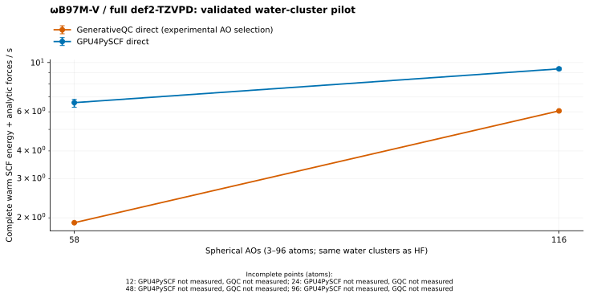
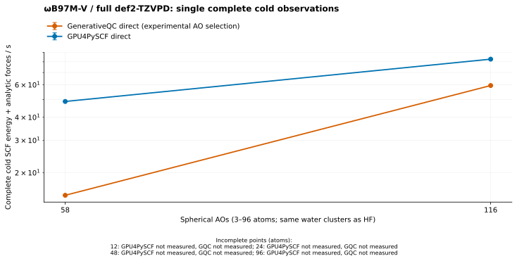

# Full def2-TZVPD WB97M-V: validated through 24 atoms

The complete spherical def2-TZVPD candidate is faster than paired GPU4PySCF
at **3 and 6 atoms**, but slower at **12 and 24 atoms**. All **132** original,
displaced and fixed-density replay energy/force calls pass. The required series
continues through **48 / 96 atoms**; those points are not yet qualified
and remain marked pending. Both engines use matched full grids, including
diffuse functions and f shells, rather than default grids or OMol25's ORCA
workflow.





At 3 atoms / 58 AOs, native/reference warm medians are **1.901599 / 6.597737 s**;
prepared cold is **15.094466 / 48.756339 s**. At 6 atoms / 116 AOs, warm is
**6.057546 / 9.365635 s** and prepared cold is **59.496629 / 82.725074 s**.
At 12 atoms / 232 AOs, warm is **62.961973 / 18.200958 s** and prepared cold
is **697.619542 / 181.337490 s**: native is 3.46× slower warm and 3.85× slower
cold. At 24 atoms / 464 AOs, warm is **584.661243 / 57.365026 s** and prepared
cold is **5752.509670 / 471.074847 s**: native is 10.19× slower warm and
12.21× slower cold. Its moved endpoint is **3613.400059 / 461.765581 s** and
moved-warm is **590.608857 / 57.454363 s**.

The 24-atom point uses a newer bounded-capacity build and explicit 4 GiB force
host/device budgets; 3/6/12 retain their original source and budgets. These
points are observations from separately pinned runs, not a same-binary scaling
experiment or an optimization comparison. The plots use the native control
without a preliminary source. Five warm samples,
including their full min–max range, enter each point. Both geometries pass;
none of the moved-geometry data is discarded. Native/reference moved endpoints
at 3/6/12 atoms are 10.223373 / 47.047833 s, 35.810974 / 75.977163 s, and
406.264923 / 152.409236 s respectively.

## Cold source cost and interpretation

Cold counts synchronized native batch preparation plus the first complete
energy/analytic-force endpoint, including returned host forces. A preliminary
source's entire lifecycle and wrapper are charged to that preparation. The
inherited OMol25 runner constructs the native Calculator and obtains its build
metadata outside this boundary; reference engine construction belongs to its
preparation. Python imports, library probes and an empty compiler/filesystem
cache are outside this protocol. These prepared-cold samples are not whole
process startup or a comparison with the earlier, differently defined SVP cold
campaign.

The private same-basis LDA source reduces target iterations **17 → 14** and
**21 → 15**, but costs **2.060542 s** and **13.101987 s**. Complete native cold
becomes **15.029039 s** and **57.390845 s**. The tiny 3-atom difference is not an
established gain; the single ordered 6-atom observation is 3.54% lower, pending
reverse-order/repeated cold and larger controls. At 12 atoms, LDA costs
**262.989625 s**, reduces target iterations **25 → 19**, and makes complete
cold **803.081423 s**, an observed 15.12% regression. Its solve alone costs
262.663043 s; reducing target iterations does not repay the source lifecycle.
Source iteration counts are 14, 18 and 24. Full source construction,
preparation, solve, density export,
GPU admission, destruction and bookkeeping are individually retained in the
raw records; their sum is checked. Fock-build counts remain null when unavailable.
No CPU/reference density is imported and no public initialization policy or
combined source/target budget is qualified.

No LDA source was run at 24 atoms after the 12-atom regression; its absence
is not a zero-cost seed observation. At 24 atoms, batch preparation is only
1.644111 s of the 5752.509670 s cold endpoint. The recorded force stage is
350.091709 s, including 325.532083 s of integral derivatives and 11.531925 s
of force preparation. The remaining 5400.773851 s is an arithmetic remainder,
not an independently measured SCF or exchange timer. Likewise, the combined
12.981081 s geometry/pair drain cannot be labeled VV10 alone. Native still
takes much longer despite fewer SCF iterations, supporting priority on the
repeated integral/value work as well as force derivatives.

Native/reference cold iterations are **17/35**, **21/40**, **25/45** and
**22/39** at 3/6/12/24 atoms. Warm is one
iteration throughout. Thus cold ratios include distinct SCF trajectories and
cannot be interpreted as per-Fock or per-kernel speedups. Native density-RMS
and reference orbital-gradient stopping criteria retain their separate
meanings. The final physical energy/force gates apply independently of those
iteration counts.

The SCF point-AO-square domains at one traversal are 76.51% and 49.73% of the
full-AO domains at 3 and 6 atoms; the 12-atom fraction is 51.04%.
These are observed contraction-domain counts,
not FLOPs or end-to-end speedup estimates. The preliminary source uses full AO
maps. Native force telemetry retains missing shell-work counters as null.
The 96-atom full-basis case has 1,856 AOs and exceeds the original 3/6/12
binary's 1,024-AO force limit. The #1761 capacity composition raises the bound
to 2,048 with explicit complete resource admission and supplies the accepted
24-atom point. It does not retroactively change the frozen 3/6/12 measurements,
and no completed native 48/96-atom endpoint is claimed here.

## Protocol, identity and validation

- Exact offline H/O basis: [canonical snapshot](../omol25-wb97mv-20261001/def2-tzvpd-ho.json),
  identity `d31ca86767ff87674e1c93f1ec4f874d16d22b187db0b77c0a9af7c2b9a29ad8`.
  Both engines use the same nested water clusters as the HF graph, with the
  second atom displaced by +0.001 Bohr along z for the second geometry.
- Full 48 × 16 × 32 moving quadrature per atom, shared by semilocal and VV10;
  73,728 / 147,456 / 294,912 / 589,824 points. VV10 density cutoff 1e-8
  and reference weight cutoff
  1e-14. Native energy/density/screening tolerances 1e-12 / 1e-10 / 1e-12;
  reference energy/orbital-gradient/direct-screening 1e-12 / 1e-10 / 1e-14.
  Maximum 100 target iterations; no density fitting in the target.
- Full-density reference Fock rebuilds; every recorded semilocal XC component
  reports actual CUDA LibXC execution. Five frozen engine-local density replays
  at each geometry. Native SCF AO maps, 1e-16 force AO maps with a 64 MiB optional
  cache, and indexed Schwarz scheduling are explicit candidate controls.
- The source is LDA/RKS with the **same orbital basis**, grid 16 × 8 × 16,
  energy/density controls 1e-6 / 1e-4, at most 64 iterations and DIIS history 8.
  Source AO discovery is disabled; target policy is restored on every exit.
- n1 RTX 5090, finite Slurm 5719 (3 atoms), 5720 (6 atoms) and 5721 (12 atoms), each 8 CPUs and
  16 GiB host allocation. All three BLAS thread settings are 8. Separate ordered
  reference, native-none and native-LDA processes share one allocation per size.
- Master `d22c92d8fca233e3eb742033e923ed8dac004c42`; measured clean source archive
  `e45e29c99c12496a35d24b4f331070252aa21ab2`, built from production-equivalent
  merge `20543ad6feeda9bb1649d09fe24233ecbfd0b77f`.
  1,368-input source identity
  `cfa2c4ba884356aac64d309dbc4b2d8d97748afc395fea5a56124d78169b2e0b`;
  library SHA-256
  `db20557ede9cd4471c0bf7659666f01431fda72eae2fc01434551fe90cc62b4c`.
- Release/sm_120 with 458 verified ccache compiler commands. Current-composition
  Slurm 5718 passes three native executables, four admission cases and seven
  E/F/displacement/stale-state cases in each of sparse and zero-force-cache
  modes. Each mode observes 66 successful calls and 467 XC submissions.
- The 24-atom point uses production `302039f8e26a30c2efb6578d409d6c83f8930493`,
  source identity
  `bd67b5aa0b87fc329d84a002c6fae8c518f41177246a5b9d06415b2897810178`,
  library SHA-256
  `4da2d760e4b85e6c8ab5aee199cd541f3240656967f706c0765bdebf62ba488e`.
  Native and reference share n1 Slurm **5725 / device 2**, 8 CPUs and 24 GiB
  host allocation. Force host/device budgets are each 4 GiB, and the optional
  force AO cache remains 64 MiB. Its independent pair is retained separately
  in `qualification.capacity24`; the earlier build-gate receipts apply only
  to the original 3/6/12 composition.
- All 132 endpoint calls pass 1e-8 Eh / 1e-7 Eh/Bohr gates; largest errors are
  5.457e-12 Eh and 5.695e-10 Eh/Bohr. All raw forces, timings, residual fields,
  outcome codes, source costs and provenance remain in the shared compressed
  [samples](samples.json.gz). [Summary](summary.json) is recomputed by the verifier.
  [Qualification](qualification.json) retains the initial offline validator's
  metadata/string mismatch and its correction. All GPU point processes exited
  zero; fixing that reader did not rerun or alter measurements.

The publication accepts numerical evidence and retains observed timings. It
does not promote a default based on non-interleaved samples, absent whole-device
peak measurements or unqualified larger/resource-boundary cases.

## Reproduce and verify

Build the pinned checkout with ccache, Release CUDA sm_120 and a matching Python
runtime. Select that library with `GENERATIVEQC_LIBRARY`; set `PYTHONPATH=.:python`
and the three BLAS thread variables to 8. Inside a finite Slurm main allocation
with `--gres=gpu:5090:1`, set `GENERATIVEQC_CUDA_KS_ACTIVE_AO=1` and
`GENERATIVEQC_BOUNDED_SCHWARZ_SCHEDULE=indexed`. For each admitted size:

```bash
python -m benchmarks.readme_omol25 reference --atoms 6 \
  --basis-file benchmarks/results/omol25-wb97mv-20261001/def2-tzvpd-ho.json \
  --reference-full-fock --repeats 5 --output .artifacts/tzvpd/reference.json
python -m benchmarks.readme_omol25 native --atoms 6 \
  --basis-file benchmarks/results/omol25-wb97mv-20261001/def2-tzvpd-ho.json \
  --reference-full-fock --repeats 5 --force-active-ao --preliminary-provider none \
  --reference .artifacts/tzvpd/reference.json --output .artifacts/tzvpd/none.json
```

These commands reproduce the original 3/6/12 campaign. Repeat native with
`--preliminary-provider lda16` and a separate output for its retained seed
controls. For 24 atoms, use the separately pinned capacity build, change
`--atoms` to 24, add `--force-max-device-bytes 4294967296` and
`--force-max-host-bytes 4294967296` to native, and retain
`--preliminary-provider none`; there is no measured 24-atom LDA variant. Do not
skip the original or displaced force gates or plot partial/timeout results.
For a CPU-only, read-only verification of this publication, including all
stored hashes, every E/F pair and complete source-phase accounting:

```bash
PYTHONPATH=.:python python -O benchmarks/results/wb97mv-tzvpd-cold-20261004/verify.py
```
